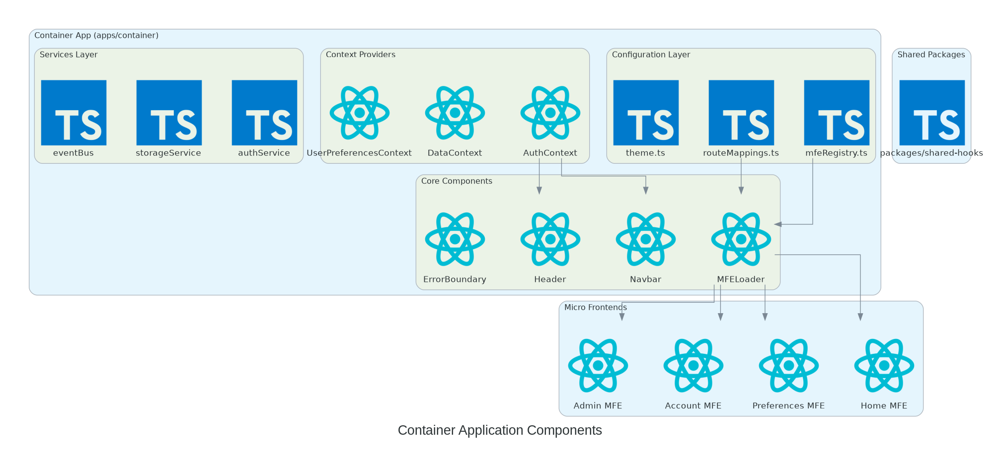

# MFE Demo - Micro Frontend Architecture

An MFE architecture demo using React, TypeScript, React Router, Material UI v6, AWS Amplify and Cognito.

## 📚 Documentation

- **[Quick Start Guide](./QUICKSTART.md)** - Get started in 5 minutes
- **[Developer Guide](./DEVELOPER.md)** - Comprehensive development documentation
- **[Architecture Diagrams](./docs/diagrams/)** - Visual architecture diagrams (PNG)
- **[Shared Hooks Guide](./SHARED_HOOKS_GUIDE.md)** - Creating hooks shared across MFEs
- **[AWS Deployment Guide](./AWS_DEPLOYMENT_GUIDE.md)** - CloudFormation & AWS CLI deployment (production-ready)
- **[Testing Guide](./TESTING.md)** - Testing strategies and setup
- **[Troubleshooting Guide](./TROUBLESHOOTING.md)** - Common issues and solutions
- **[Custom Theme Guide](./CUSTOM_THEME_GUIDE.md)** - Theme customization
- **[SOLID Principles Guide](./SOLID_PRINCIPLES.md)** - Architecture and design patterns

## 🚀 Quick Start

```bash
# Install dependencies
yarn install

# If Cypress binary download fails (restricted networks/CI), use this instead:
# CYPRESS_INSTALL_BINARY=0 yarn install

# Start all applications (container + all 4 MFEs) in development mode
yarn dev

# OR start just the container app
yarn dev:container

# Open http://localhost:4000
```

Want to test production builds locally?

```bash
# Build and run production locally
yarn prod:local

# Or skip rebuild if already built
yarn prod:local --skip-build
```

## Deployed Application

### Regular user

username: demo@gmail.com

password: Password$123

### Admin user

username: demo_admin@gmail.com

password: Password$123

[Running app](https://mfe.world/container/)

## Overview

This project demonstrates a micro frontend (MFE) architecture using modern web technologies without relying on complex MFE libraries like single-spa or Module Federation. It uses import maps and supports independent development and deployment of each micro frontend.

## Architecture

### High-Level MFE Architecture


### AWS Deployment Architecture


### Container Application Components



### Data Flow


> 📁 See [docs/diagrams](./docs/diagrams/) for full-size diagrams and documentation.

## Technology Stack

### Frontend Stack

| Technology   | Version | Purpose                                 |
| ------------ | ------- | --------------------------------------- |
| React        | 18.3.1  | UI framework with concurrent features   |
| Material UI  | 6.1.6   | Component library for consistent design |
| TypeScript   | 5.3.3   | Type safety                             |
| React Router | 6.21.3  | Client-side routing                     |
| Vite         | 5.0.11  | Build tool and dev server               |
| AWS Amplify  | 6.0.8   | Authentication with Cognito             |

### Development Tools

| Tool            | Purpose                |
| --------------- | ---------------------- |
| Vitest          | Unit testing framework |
| Cypress         | E2E testing framework  |
| ESLint          | Code linting           |
| Prettier        | Code formatting        |
| Yarn Workspaces | Monorepo management    |

## Prerequisites

- Node.js >= 18.0.0
- Yarn >= 1.22.0

## Getting Started

### Installation

```bash
# Install dependencies for all workspaces
yarn install
```

### Development

Run all applications in development mode:

```bash
yarn dev
```

This will start all 5 applications concurrently:

- Container (port 4000)
- Home MFE (port 3001)
- Preferences MFE (port 3002)
- Account MFE (port 3003)
- Admin MFE (port 3004)

Run individual applications:

```bash
# Container app (port 4000)
yarn dev:container

# Home MFE (port 3001)
yarn dev:home

# Preferences MFE (port 3002)
yarn dev:preferences

# Account MFE (port 3003)
yarn dev:account

# Admin MFE (port 3004)
yarn dev:admin
```

### Building

Build all applications:

```bash
yarn build
```

Build individual applications:

```bash
yarn build:container
yarn build:home
yarn build:preferences
yarn build:account
yarn build:admin
```

### Running Production Locally

Run production builds locally to test the production setup:

```bash
# Build and run all applications in production mode
yarn prod:local

# Or skip rebuild if already built
yarn prod:local --skip-build
```

This will:

1. Build all applications (if needed)
2. Start all preview servers on their respective ports
3. Open http://localhost:4000 to view the application

You can also run preview servers individually:

```bash
yarn preview:container  # Preview container on port 4000
yarn preview:home       # Preview home MFE on port 3001
yarn preview:preferences # Preview preferences MFE on port 3002
yarn preview:account    # Preview account MFE on port 3003
yarn preview:admin      # Preview admin MFE on port 3004
```

### Testing

Run all tests:

```bash
yarn test
```

Run unit tests:

```bash
yarn test:unit
```

Run E2E tests (container only):

```bash
yarn test:e2e
```

### Linting & Formatting

```bash
# Lint all code
yarn lint

# Format all code
yarn format

# Check formatting
yarn format:check
```

## Project Structure

```
mfe-demo/
├── apps/
│   ├── container/       # Main container application
│   ├── home/            # Home MFE
│   ├── preferences/     # Preferences MFE
│   ├── account/         # Account MFE
│   └── admin/           # Admin MFE (protected)
├── packages/            # Shared packages (future)
└── ...config files
```

## Authentication

The application uses AWS Cognito for authentication. To configure:

1. Copy `.env.example` to `.env` in the container app
2. Update the following environment variables:
   - `VITE_COGNITO_USER_POOL_ID`
   - `VITE_COGNITO_CLIENT_ID`
   - `VITE_AWS_REGION`

## Protected Routes

The Admin MFE is protected and requires users to have the `admin` group in Cognito to access.

## Deployment

### Production Deployment (Recommended)

Use CloudFormation and AWS CLI for a complete production deployment:

```bash
# 1. Configure deployment
cp deployment/config.example.yaml deployment/config.yaml
# Edit config.yaml with your AWS settings

# 2. Deploy infrastructure (S3, CloudFront, Cognito)
./deployment/deploy-cloudformation.sh all

# 3. Build and deploy all applications
./deployment/deploy-apps.sh all
```

See the **[AWS Deployment Guide](./AWS_DEPLOYMENT_GUIDE.md)** for complete instructions.

### Quick Deployment (Development)

For simple deployments to existing S3/CloudFront:

```bash
# Build for production
yarn build:<app-name>

# Deploy to S3 (requires AWS CLI configured)
aws s3 sync apps/<app-name>/dist s3://app.mfeworld.com/<app-name>/
```

## Testing Strategy

### Unit Tests (Vitest)

- Component Testing
- Context Testing
- Hook Testing
- Utility Testing

### E2E Tests (Cypress)

- Authentication Flow
- Navigation
- Protected Routes
- User Interactions

### Coverage Goals

- Statements: > 80%
- Branches: > 75%
- Functions: > 80%
- Lines: > 80%

## Contributing

Please follow the PR naming convention: `step<N>-<meaningful-name>`

Examples:

- `step1-setup-monorepo`
- `step2-add-authentication`
- `step3-implement-mfe-loader`

## License

MIT
