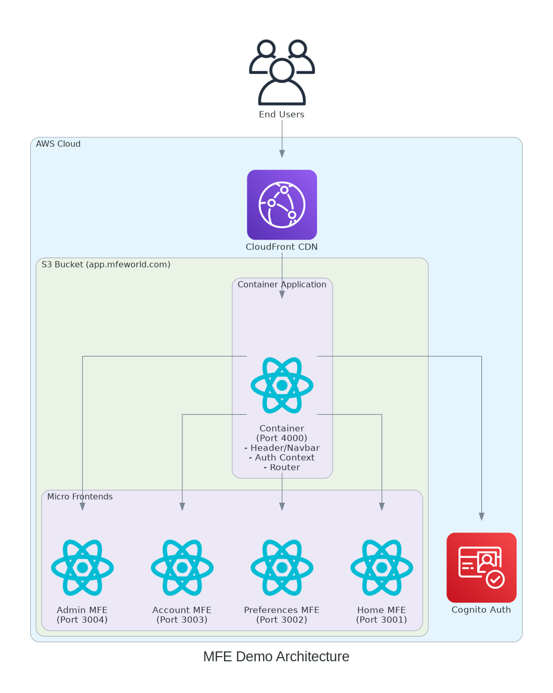
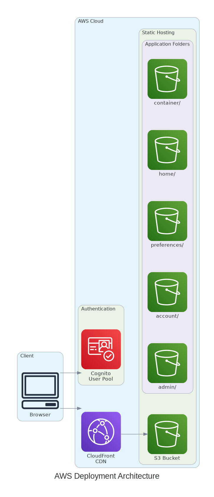
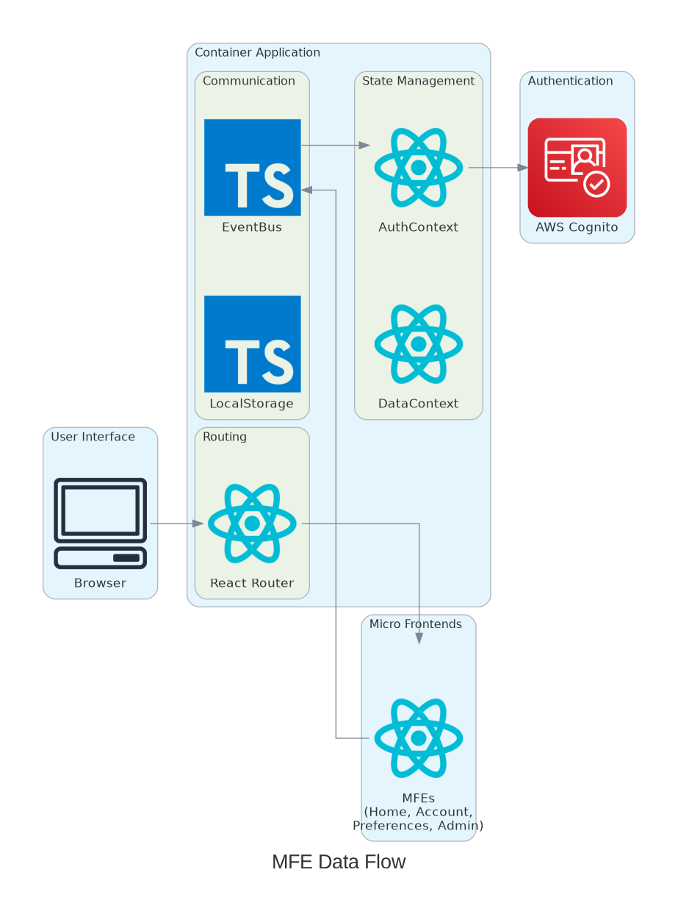
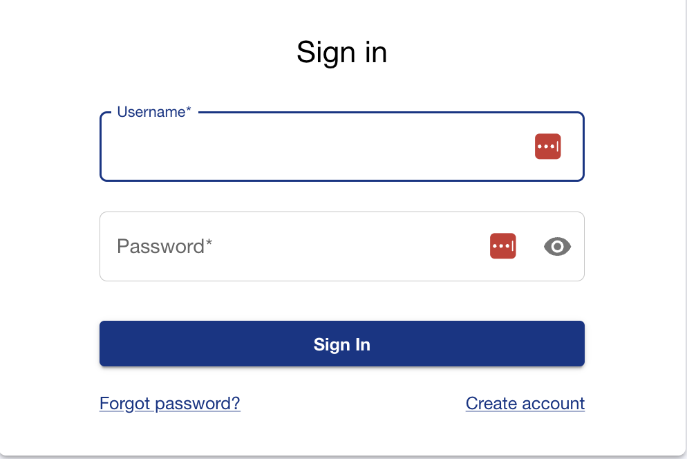

# Implementing Amazon Cognito in a Micro-Frontend World (Medium-Style Walkthrough)

Micro-frontends let teams ship independently, but authentication must feel consistent everywhere. In this MFE demo, Cognito (via AWS Amplify) gives us a single source of truth for identity, roles, and MFA while each micro-frontend stays autonomous. This story shows the architecture, the flows we support, and how to replicate the setup in your own app—with visuals and the custom auth screen we ship.

---

## Architecture at a Glance

**1) Micro-frontend landscape**



*Container + four MFEs (Home, Account, Preferences, Admin) share a Cognito-backed auth layer exposed through a common AuthContext and service abstraction.*

**2) Deployment topology**



*CloudFront fronts multiple S3 buckets (one per MFE). Cognito issues tokens that every MFE trusts via the container’s shared auth service.*

**3) Auth/data flow**



*Browser → Router → AuthContext → Cognito → token-backed calls. EventBus keeps MFEs loosely coupled while auth state is consistent.*

---

## What Cognito Features Are Enabled Here

- **Hosted user pool + app client** (CloudFormation template `cloudformation/templates/cognito.yaml`)
- **Email-based usernames** with email verification
- **Sign-in / Sign-up / Confirm sign-up**
- **Password reset (initiate + confirm)**
- **Session tokens (ID/Access/Refresh)** with configurable validity
- **Optional MFA** (software token) with advanced security mode in audit
- **Groups/roles**: `admin` and `user`, used for admin-only routes
- **Secure OAuth callbacks/logout URLs** for local and prod
- **Swappable provider**: `IAuthService` interface allows replacing Cognito with Auth0/Firebase without touching consumers

---

## The Custom Cognito Experience (Screenshots)

Our MFEs use a custom-styled auth surface instead of the default hosted UI.

**Custom Login Page**



The same component set powers sign-up and password-reset flows, keeping visuals on-brand while Amplify talks to Cognito behind the scenes.

---

## How It’s Wired in Code (Minimal Tour)

1) **Amplify bootstrapping**  
`apps/container/src/main.tsx` configures Amplify with environment-driven Cognito IDs (user pool, client, region, auth flow).

2) **Auth service abstraction**  
`apps/container/src/services/authService.ts` implements `IAuthService` with Amplify’s Auth methods:  
`signIn`, `signOut`, `signUp`, `confirmSignUp`, `resetPassword`, `confirmResetPassword`, `getCurrentUser`, `isAuthenticated`, `isAdmin` (group check).

3) **Context for MFEs**  
`AuthContext` consumes the service so any micro-frontend can read auth state without Cognito-specific code.

4) **Route protection**  
Admin MFE checks `isAdmin()` (Cognito group membership) before loading protected screens.

---

## Reproducing This in Your Application (Copy/Paste Playbook)

1. **Deploy Cognito**  
   - Use `cloudformation/templates/cognito.yaml` to create the user pool, client, domain, and `admin/user` groups.  
   - Collect outputs: `UserPoolId`, `UserPoolClientId`, `UserPoolDomain`, region.

2. **Configure environment**  
   - Copy `apps/container/.env.example` to `.env` and set:
     ```
     VITE_COGNITO_USER_POOL_ID=<your pool id>
     VITE_COGNITO_CLIENT_ID=<your app client id>
     VITE_AWS_REGION=<your region>
     ```

3. **Initialize Amplify early**  
   - Mirror `apps/container/src/main.tsx` to call `Amplify.configure({ Auth: { Cognito: {...} } })` before rendering.

4. **Implement the auth service**  
   - Follow `authService.ts` or swap providers by keeping the `IAuthService` contract intact.

5. **Wrap your app with AuthContext**  
   - Expose hooks/components so MFEs consume auth state without Cognito-specific imports.

6. **Enforce roles**  
   - Gate sensitive routes with `isAdmin()` (checks `cognito:groups` claim) or your own group names.

7. **Brand the UI**  
   - Customize login/sign-up/reset pages (example screenshot above) while leaving Amplify/Cognito calls untouched.

8. **Test end-to-end**  
   - Create users in the pool (assign `admin` where needed).  
   - Validate sign-in, sign-up + confirmation, password reset, refresh tokens, and admin-only routes.

---

## Quick FAQ

- **Can I swap Cognito later?** Yes—keep `IAuthService` stable and reimplement the class.  
- **Where do I change MFA or password rules?** In the CloudFormation template (`PasswordPolicy`, `MfaConfiguration`).  
- **How do I add social IdPs?** Add them to the user pool client and surface them in the custom UI; the service abstraction stays the same.  
- **What about local dev?** Callback URLs already include `http://localhost:3000`. Set the `.env` values and run `yarn dev`.  

---

You now have the architecture, the flows, and the custom screens. Deploy the template, drop in your IDs, keep the `IAuthService` contract, and your MFEs will share a single Cognito-powered identity plane without sacrificing independent delivery.***
